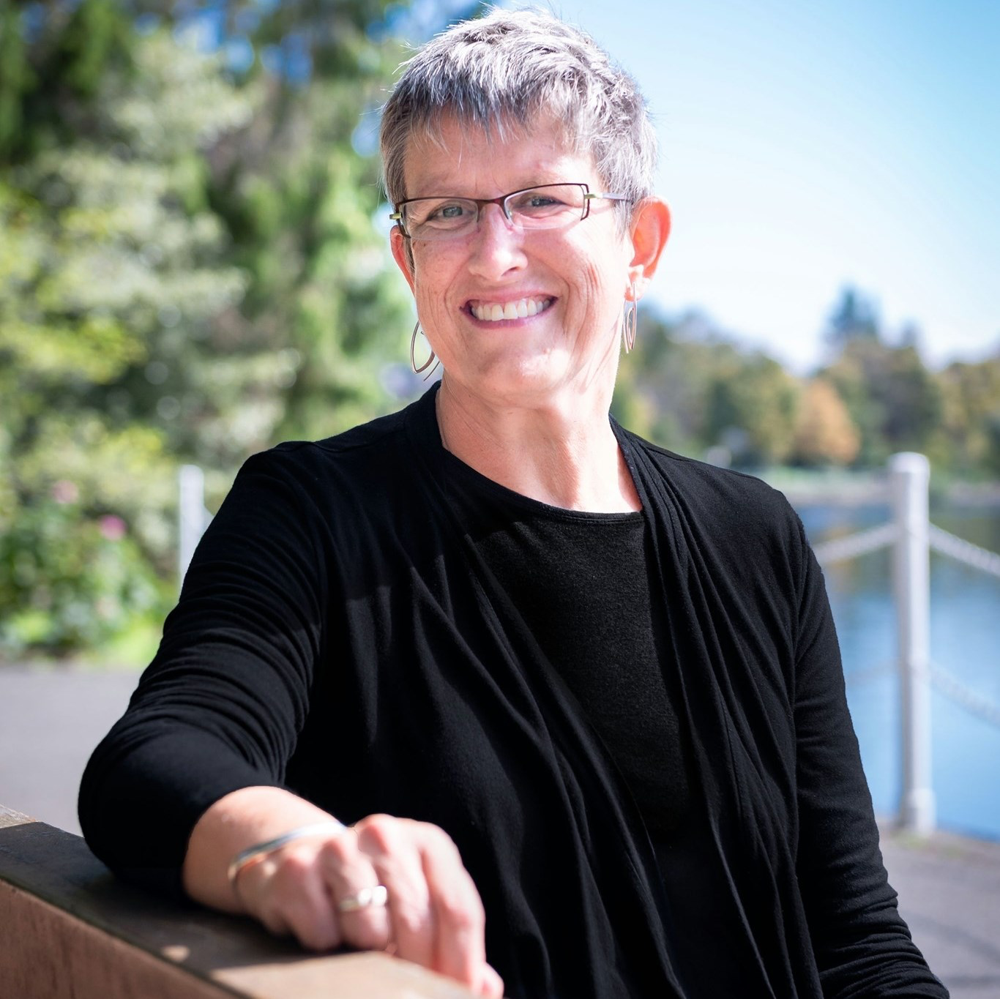

# Annemieke Holthuis

## BC Green Party

[Official Page](https://www.bcgreens.ca/annemieke_holthuis)

[Twitter](https://twitter.com/AeHolthuis)

[LinkedIn](https://www.linkedin.com/in/annemieke-holthuis-19482272/)

Holthuis is a human rights attorney who has worked as a legal advisor to the Government of Canada, representing the country at G7 meetings and international treaty negotiations. She has said the three most pressing issues facing BC are the COVID-19 pandemic, the opioid crisis and climate change. Holthuis is married to David Merner who recently competed for the leadership of the Green Party of Canada and ran for the federal Liberals in 2015.
