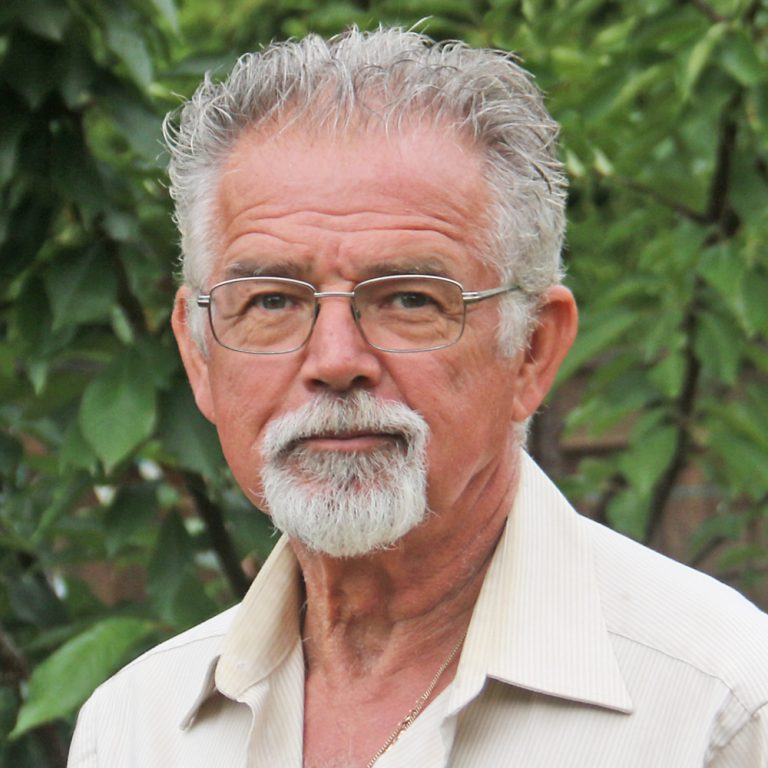

# Don "Duck" Paterson

## BC Liberal Party

[Official Page](https://www.bcliberals.com/team/duck-paterson/)

[Facebook](https://www.facebook.com/DuckPatersonCandidate/)

[Instagram](https://www.instagram.com/duckpatersoncandidate_bclp/)

Don “Duck” Paterson has served on Ladysmith Council for 32 years, 30 of which were consecutive. He is a career newsman, serving as the production manager for the Nanaimo News Bulletin for 25 years, until a brain aneurysm surgery in 2013. He currently works on a friend’s cattle farm. A native of Port Alberni, he and wife Tracy moved to Ladysmith in 1975. Throughout, he has been an active fundraiser, being instrumental in raising $90,000 for the Nat’sumaat Sya’as carving at Ladysmith Secondary, $100,000 for Ladysmith Family and Friends and $36,000 for picnic tables in Downtown Ladysmith. He and his wife were awarded Citizens of the Year in 2000. 
