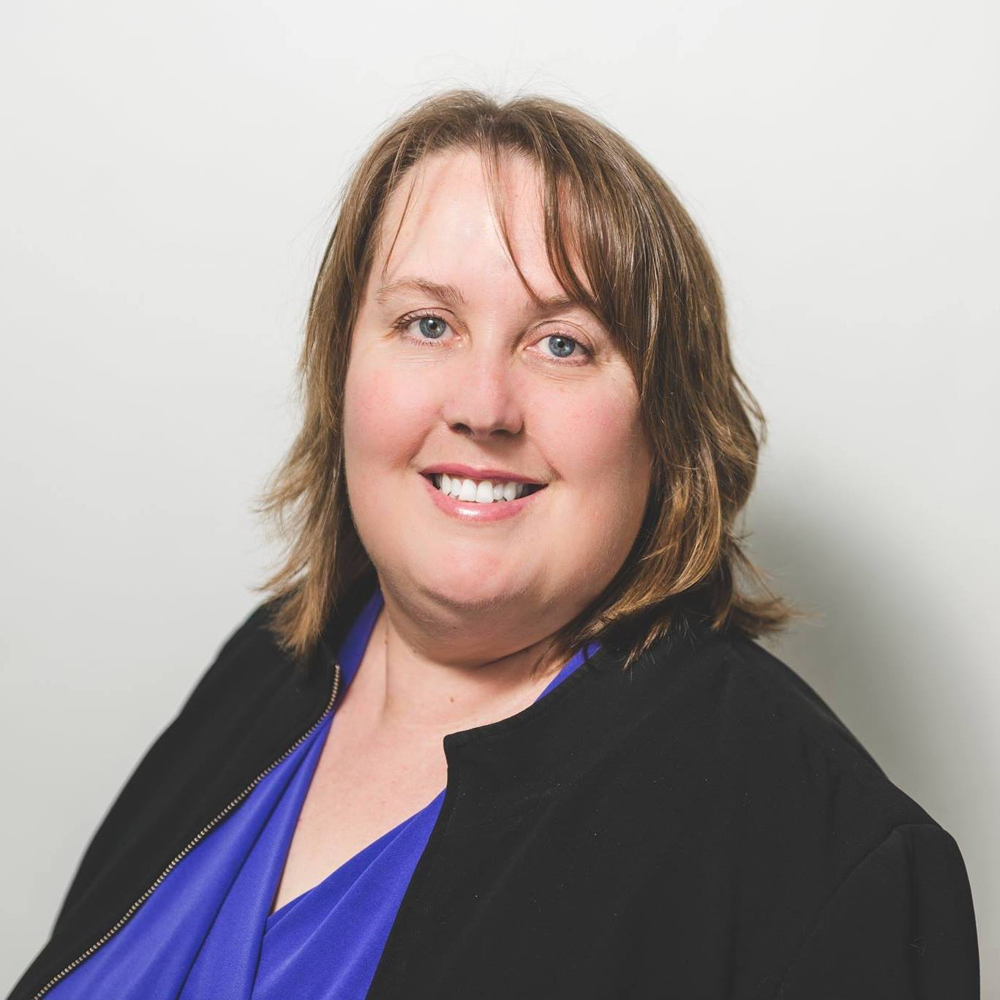

# Karen Bill

## BC Liberal Party

[Official Page](https://www.bcliberals.com/team/karen-bill/)

[Twitter](https://twitter.com/karenfbill?lang=en)

Bill is making her second run to serve as MLA in the Victoria-Beacon Hill riding. Born and raised in Victoria, she has worked in the BC public service for more than a decade, including four years as Chief of Staff for the Minister of Agriculture. She is also Vice President of the Canadian Hemochromatosis Society and volunteers with the Girl Guides. Bill has pledged to put an end to camping in Beacon Hill and Central Park and is vocal about the rise in break-ins across the city. She is also advocating for increased funding for mental health and addiction support for BC’s homeless. 
