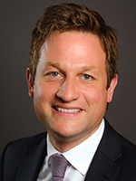

# Rob Fleming

## BC NDP

[Official Page](https://robfleming.bcndp.ca)

[Twitter](https://twitter.com/Rob_Fleming)

Fleming is running for re-election in Victoria-Swan Lake and served as Minister of Education in the 41st Parliament. Fleming started his career in government as a policy analyst for the Ministry of Advanced Education and from 2009-2013 he was the Opposition Critic for Education. Before his first election to the BC Legislature in 2005 at the age of 33, Fleming served two terms as a Victoria City Councillor. In 2013, Fleming was briefly a contender to lead the NDP, before ultimately staying out of the nomination process when both John Horgan and Mark Farnworth announced their run for the nomination. He is an avid soccer player.
