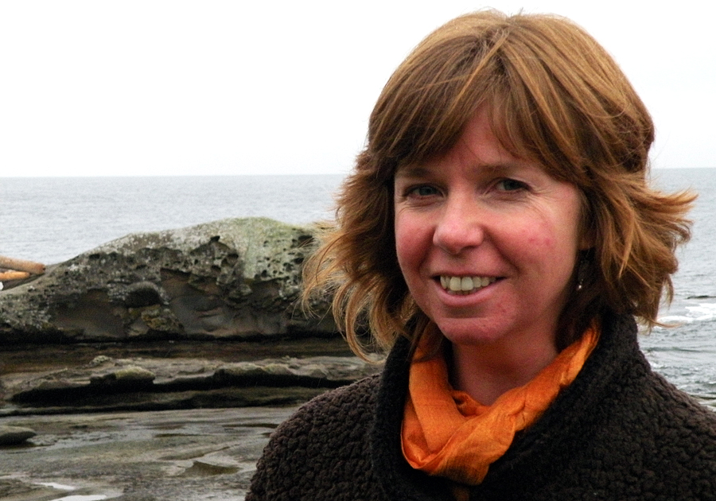

# Sheila Malcolmson

## BC NDP

[Official Page](https://sheilamalcolmson.bcndp.ca)

[Twitter](https://twitter.com/s_malcolmson)

Sheila Malcolmson is running for re-election in Nanaimo, having won a by-election in the riding on January 30, 2019. In the government of John Horgan she served as Parliamentary Secretary for the Environment. Malcolmson was the MP for Nanaimo-Ladysmith between 2015 and 2019 before resigning to seek a seat in the provincial legislature. A resident of Gabriola Island, Sheila Malcolmson was Chair of the Islands Trust Council for six years, where she signed a protocol between the group and the Snuneymuxw First Nation. Prior to entering politics Malcolmson worked at the Canadian Institute for Environmental Law and Policy, as well as with Energy Probe, an anti-nuclear advocacy group.
