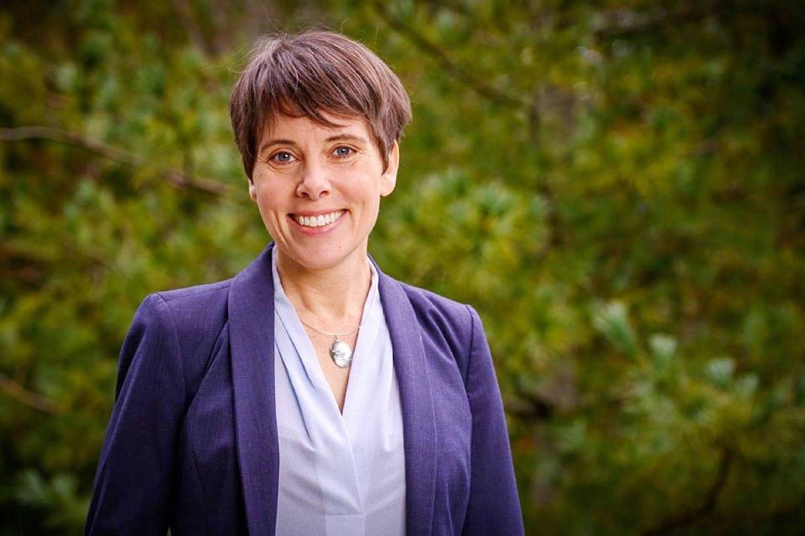

# Sonia Furstenau

## Leader of BC Green Party

[Official Page](https://www.bcgreens.ca/sonia_furstenau)

[Resume](https://www.soniafurstenau.ca/resume/)

[Twitter](https://twitter.com/soniafurstenau)

Elected leader of the BC Green Party only days before the current election, Sonia Furstenau is running for re-election in the Cowichan Valley. With a BA and an MA in history, Furstenau was a teacher in both public and private schools before entering public life. Furstenau has also served as national administrator for Results Canada, a non-profit that works to end extreme poverty, and as a board member of Oikocredit, an international microcredit organization. Before her 2017 election as MLA Furstenau was Area B Director for the Cowichan Valley Regional District.
